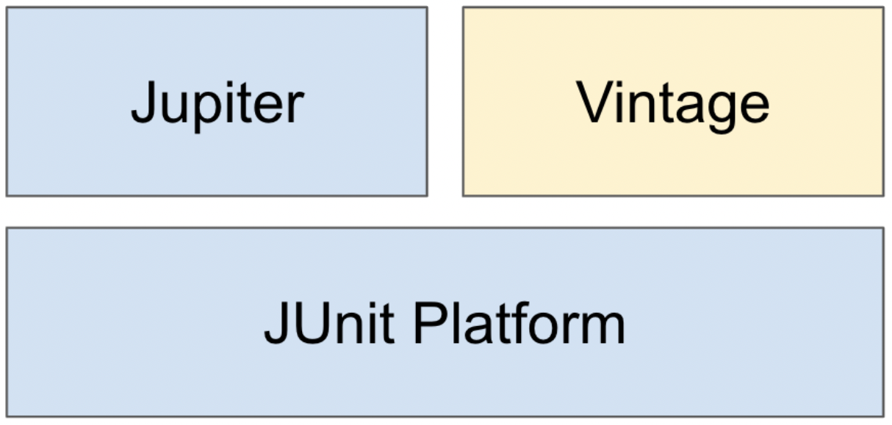
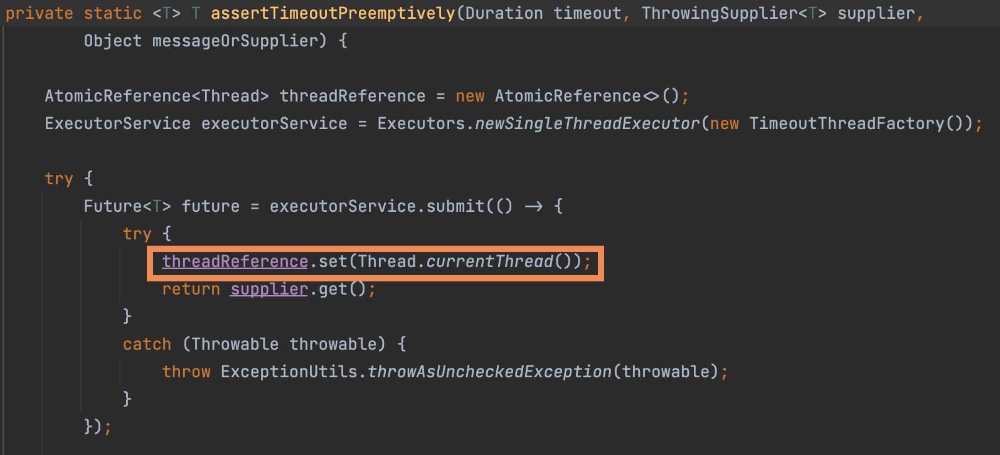

# 더 자바, “애플리케이션을 테스트하는 다양한 방법”

# 1부 JUnit 5

## JUnit 5 소개

자바 개발자들은 **JUnit**으로 **단위 테스트코드**를 작성한다. <br>JUnit은 자바 8 이상을 필요로 하고있다.

- JUnit **Platform**은 테스트를 실행해주는 환경을 제공해준다.
- **Jupiter**는 TestEngine API **구현체**로 **JUnit5**를 제공
- **Vintage**는 **JUnit 4와3**을 지원하는 **구현체**




## Unit 5 시작하기

기본 애노테이션

- @BeforeAll
  - 사용 시 앞에 static을 붙여아한다
- @AfterAll
  - 사용 시 앞에 static을 붙여아한다
- @BeforeEach
- @AfterEach
- @Disabled
  - 실행시키고 싶지 않은 Test코드 상단에 붙인다

```java
@Test
void create() {
  System.out.println("create");
}

@Test
void create2() {
  System.out.println("create2");
}

@BeforeAll
static void beforeAll() {
  System.out.println("beforeAll");
}

@AfterAll
static void afterAll() {
  System.out.println("afterAll");
}

@BeforeEach
void beforeEach() {
  System.out.println("beforeEach");
}

@AfterEach
void afterEach() {
  System.out.println("afterEach");
}
```


## Unit 5 테스트 이름 표시하기

**@DisplayName** 어떤 테스트인지 테스트 이름을 보다 쉽게 표현할 수 있는 방법을 제공하는 애노테이션.

```java
@Test
@DisplayName("create 메서드를 실행하는 단위테스트 함수")
void create_new_study() {
  Study study = new Study();
  System.out.println("create");
}
```

- **create_new_study**와 같이 메소드명은 카멜케이스 보단 **스네이크 방식**이 **가독성이 좋다**


## Unit 5 Assertion

| 메소드명                               | 설명                                  |
| -------------------------------------- | ------------------------------------- |
| assertEqulas(expected, actual)         | 실제 값이 기대한 값과 같은지 확인     |
| assertNotNull(actual)                  | 값이 null이 아닌지 확인               |
| assertTrue(boolean)                    | 다음 조건이 참(true)인지 확인         |
| assertAll(executables...)              | 모든 확인 구문 확인                   |
| assertThrows(expectedType, executable) | 예외 발생 확인                        |
| assertTimeout(duration, executable)    | 특정 시간 안에 실행이 완료되는지 확인 |

- 마지막 매개변수로 Supplier<String> 타입의 인스턴스를 람다 형태로 제공할 수 있다.복잡한 메시지 생성해야 하는 경우 사용하면 실패한 경우에만 해당 메시지를 만들게 할 수 있다.

**1. assertEqulas(expected, actual)**

- 사용법

- ```java
  assertEqulas(expected, actual);
  ```

  - **param1**: expected - **기대하는 값**
  - **param2**: actual - **실제 값**
  - **param3**: **message**
    - 바로 String을 줄 수 있고, 람다방식으로 작성할 수 있다.
    - **String 방식**: 결과가 성공/실패 하던 무조건 message를 만든다.
    - **람다방식** : 의 경우 실패할 경우에만 message를 만든다.

```java
// 1. String 방식
assertEquals(StudyStatus.DRAFT, study.getStatus(), "스터디를 처음 만들면 상태값이 DRAFT여야 한다.");

// 2. 람다방식
assertEquals(StudyStatus.DRAFT, study.getStatus(), () -> "스터디를 처음 만들면 상태값이 DRAFT여야 한다.");

```


**2. assertNotNull(actual)**

```java
Study study = new Study(-10);
assertNotNull(study);
```


**3. assertTrue(boolean)**

```java
assertTrue(study.getLimit() > 0, () -> "스터디 참석 인원은 0보다 커야한다.");
```


**4. assertAll**

아래와 같이 메시지를 모두 실행할 경우 중간에 오류가 나면 실행을 멈춘다

```java
@Test
void create_new_study2() {
  Study study = new Study(-10);
  assertNotNull(study);
  assertEquals(StudyStatus.DRAFT, study.getStatus(), () -> "스터디를 처음 만들면 상태값이 DRAFT여야 한다.");
  assertTrue(study.getLimit() > 0, () -> "스터디 참석 인원은 0보다 커야한다.");
}
```

그렇기 때문에 아래와 같이 assertAll로 묶어 실행하면 무조건 전부 실행하게 된다.

```java
@Test
void create_new_study2() {
  Study study = new Study(-10);
  assertAll(
    //assertAll은 중간에 메서드가 실패한다해도 아래 메서드를 모두 실행해준다.
    () -> assertNotNull(study),
    () -> assertEquals(StudyStatus.DRAFT, study.getStatus(), () -> "스터디를 처음 만들면 상태값이 DRAFT여야 한다."),
    () -> assertTrue(study.getLimit() > 0, () -> "스터디 참석 인원은 0보다 커야한다.")

  );
}
```


**5.assertThrows(expectedType, executable)**

```java
public Study(int limit) {
  this.limit = limit;
  if(limit < 0) throw new IllegalArgumentException("limit는 0보다 커야한다.");
}

@Test
void create_new_study3(){
  IllegalArgumentException exception = assertThrows(IllegalArgumentException.class, () -> new Study(-1));
  String message = exception.getMessage();
  assertEquals("limit는 0보다 커야한다.", message);
}
```


**6. assertTimeout(duration, executable)**

```java
@Test
@DisplayName("assertTimeout 으로 시간초과 테스트")
void assert_timeout_testing_in_study(){
  //0.1초안에 끝내야한다.
  assertTimeout(Duration.ofMillis(100), () -> {
    Study study = new Study(5);
    Thread.sleep(300); //0.3초걸림
  });
}
```

0.1초 안에 끝내야한다고 기대했지만 0.3초 걸리기에 실패한다.

또한, 위 테스트는 해당0.3초가 지날때까지 못끝난다.

```java
@Test
@DisplayName("assertTimeoutPreemptively 으로 시간초과 테스트 / 메소드 실행 시간 안기다리고 이는 0.1초만에 테스트 끝냄")
void assert_timeout_preemptively_testing_in_study(){
  //0.1초안에 끝내야한다.
  assertTimeoutPreemptively(Duration.ofMillis(100), () -> {
    Study study = new Study(5);
    Thread.sleep(300); //0.3초걸림
  });
}
```

> **assertTimeoutPreemptively**를 사용하면 해당 메서드는 0.1초만에 실행을 끝낸다.<br>실행 메서드가 얼마나 걸리는지 모르기에 **assertTimeout**을 추천한다.
>
> assertTimeoutPreemptively를 사용하면 ThrowingSupplier을 **LocalThread**로 제공한다.<br>**LocalThread**의 경우 **모든 쓰레드에 값을 공유하지 않으므로 예기치 못한 문제가 발생할 수 있다.**


## Unit 5 조건에 따라 테스트 실행하기

특정한 OS, 환경변수 등에 따라 메서드 실행여부를 결정해준다.

- org.junit.jupiter.api.Assumptions.*
  - assumeTrue(조건)
  - assumingThat(조건, 테스트)


```java
import static org.junit.jupiter.api.Assumptions.*;

@Test
void assumeTrue_test(){
  String property = System.getProperty("os.name");
  System.out.println(property);
  System.out.println("실행1");

  assumeTrue(property.startsWith("Windows"));
  System.out.println("실행2");
}
```

> **결과**
>
> Mac OS X
> 실행1

> **설명**
>
> Windows가 아니기때문에 **assumeTrue(property.startsWith("Windows"));**로 인해 <br>System.out.println("실행2");는 실행하지 않음을 알 수 있다.


